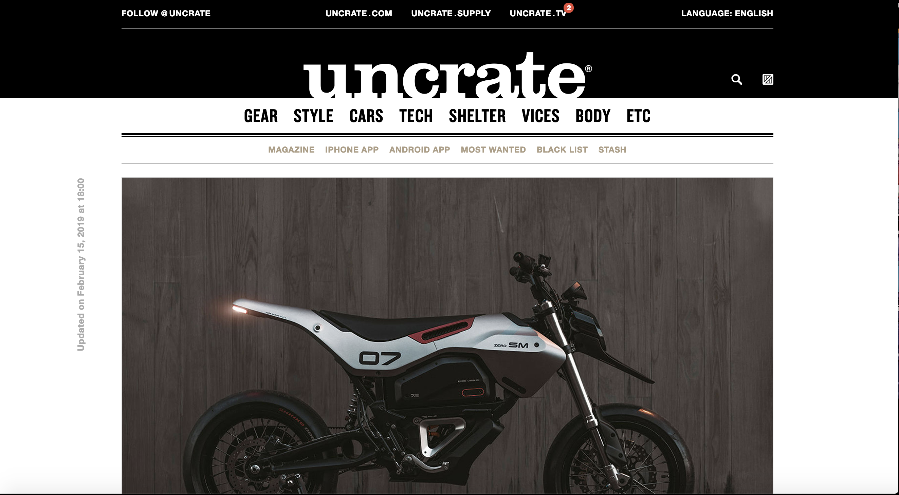

# _Uncrate Clone_

#### _A clone of the website Uncrate 2019_

#### By _** Kohichi Horii**_

## Description

* _The purpose of this project to make a clone of a website._

* _Can clone version of the website Uncrate_
* _Once website is under 700px top Nav will disappear and columns will become 100% in width_

* _Real Uncrate website preview_

* _Clone Uncrate website preview_

## Setup/Installation Requirements

* _Clone Repository https://github.com/ko1h/uncrate-clone.git_
* _Github link_
* _Open folder_
* _Open index.html_
* _use atom to open up repository *look at webpage by opening up repository then viewing through google chrome_

## Known Bugs

_Footer is not finished._

## Support and contact details

_If you are having issues you can contact us at kohichi.horii@gmail.com_

## Technologies Used

_Github, Git, HTML, CSS, SCSS_

### License

*This software is licensed under the MIT license.*

Copyright (c) 2019 **_KH_** MIT license.
